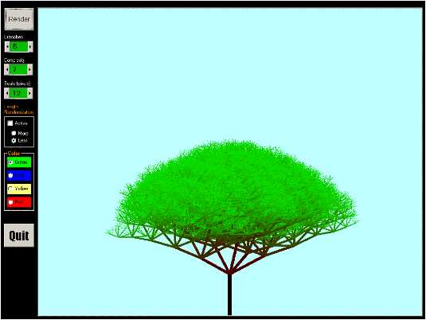



## Generate realistic Trees using recursion

### Description

This program uses the concept of fractals in nature and generates realistic Trees using recursion ( the recursion part is heavily commented ). Each branch can be thought of a small tree on its own and every other branch on that branch. Hence this program uses the concept of recursion very effectively in creating trees
 
### More Info
 

             |
---                |---
**Submitted On**   |2001-05-29 09:39:42
**By**             |[Danish Mujeeb](https://github.com/Planet-Source-Code/PSCIndex/blob/master/ByAuthor/danish-mujeeb.md)
**Level**          |Intermediate
**User Rating**    |4.8 (139 globes from 29 users)
**Compatibility**  |VB 5\.0, VB 6\.0
**Category**       |[Graphics](https://github.com/Planet-Source-Code/PSCIndex/blob/master/ByCategory/graphics__1-46.md)
**World**          |[Visual Basic](https://github.com/Planet-Source-Code/PSCIndex/blob/master/ByWorld/visual-basic.md)
**Archive File**   |[Generate r202225292001\.zip](https://github.com/Planet-Source-Code/danish-mujeeb-generate-realistic-trees-using-recursion__1-23556/archive/master.zip)

